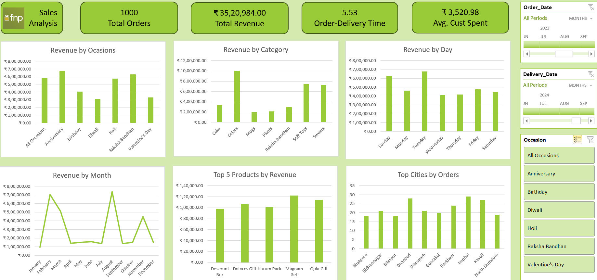

# 🎁 FNP Sales Analysis Dashboard

This project is a **Sales Analysis Dashboard** created for **Ferns and Petals (FNP)**, a company specializing in gifts for occasions like *Diwali, Birthdays, Raksha Bandhan, Holi, Anniversaries, and Valentine's Day*. The dashboard visualizes and analyzes key sales trends, customer behavior, and product performance using Power BI/Excel.

---

## 🚀 Project Overview

The dataset includes details about:
- **Products**
- **Orders**
- **Customers**
- **Order and Delivery Dates**

The interactive dashboard answers key business questions to improve FNP's sales strategies and optimize customer satisfaction.

---

## 📊 Dashboard Insights

1. **Total Revenue**  
   Total revenue generated: ₹35,20,984.00

2. **Average Order and Delivery Time**  
   Average order-to-delivery time is **5.53 days**.

3. **Monthly Sales Performance**  
   Sales trends indicate peak performance in **March and September**.

4. **Top Products by Revenue**  
   - **Deserunt Box**  
   - **Dolores Gift Harum Pack**  
   - **Magnam Set**  
   - **Quia Gift**

5. **Customer Spending Analysis**  
   Average customer spend: ₹3,520.98

6. **Revenue Comparison Between Occasions**  
   Top-earning occasions include:  
   - **Anniversary**  
   - **Raksha Bandhan**

7. **Top Cities by Orders**  
   - **Imphal** (Highest)  
   - **Kavali**  
   - **Bidhan Nagar**

8. **Product Popularity by Occasion**  
   Certain products outperform based on specific occasions, e.g., "Colors" during festive events.

---

## 🖥️ Technology Used

- **Microsoft Excel** for data analysis and visualization.
- **Interactive Charts** to explore trends across:
   - Occasions
   - Categories
   - Time (Months, Days)
   - Cities
- **KPIs** for quick insights into revenue, orders, and customer behavior.

---

## 📝 Key Business Questions Addressed

1. What is the overall revenue?  
2. What are the peak sales months?  
3. Which products generate the most revenue?  
4. How do revenues compare across occasions?  
5. What are the top cities driving sales?  

---

## 🔗 Project Snapshot

